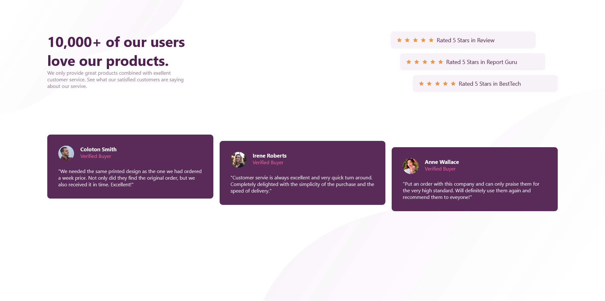

# Frontend Mentor - Social proof section solution

This is a solution to the [Social proof section challenge on Frontend Mentor](https://www.frontendmentor.io/challenges/social-proof-section-6e0qTv_bA). Frontend Mentor challenges help you improve your coding skills by building realistic projects. 

## Table of contents

- [Frontend Mentor - Social proof section solution](#frontend-mentor---social-proof-section-solution)
  - [Table of contents](#table-of-contents)
  - [Overview](#overview)
    - [The challenge](#the-challenge)
    - [Screenshot](#screenshot)
    - [Links](#links)
  - [My process](#my-process)
    - [Built with](#built-with)
    - [What I learned](#what-i-learned)
    - [Continued development](#continued-development)
  - [Author](#author)

## Overview

### The challenge

Users should be able to:

- View the optimal layout for the section depending on their device's screen size

### Screenshot



### Links

- Solution URL: [Add solution URL here](https://github.com/bhaveshdaswani93/social-proof-section)
- Live Site URL: [Add live site URL here](https://social-proof-section-six-iota.vercel.app/)

## My process

### Built with

- Flexbox
- CSS Grid
- Mobile-first workflow
- [React](https://reactjs.org/) - JS library
- [Next.js](https://nextjs.org/) - React framework


### What I learned

In this challeng I have learn css grid implementation

To see how you can add code snippets, see below:

```scss
 &__reviews {
        // display: flex;
        // justify-content: space-between; 
        display: grid;
        grid-template-columns: 1fr 1fr 1fr;
        column-gap: 20px;
        // justify-content: end;
        align-items: end;
        @media screen and (max-width:1024px) {
            display: flex;
            flex-direction: column;
          }
    }
```


### Continued development

I would like design and develop full landing page with responsiveness

## Author

- Frontend Mentor - [@bhaveshdaswani93](https://www.frontendmentor.io/profile/bhaveshdaswani93)
- Twitter - [@digitaldaswani](https://www.twitter.com/digitaldaswani)


